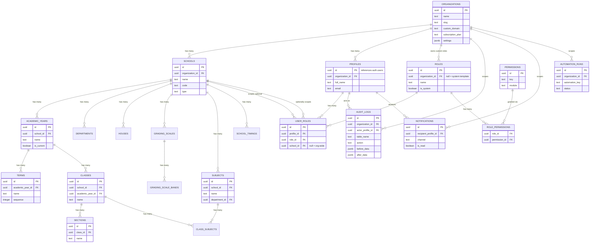

# ER Diagram — Phase 1 Core Foundation

This covers only the tables created in `001_core_foundation.sql`. Every later phase adds its own ER diagram in its own doc file (e.g. `phase-3-er-diagram.md`) that extends this one — we never redraw the whole diagram from scratch, we append.

## Key relationship rules encoded here

1. **Every tenant-owned table hangs off `organizations` or `schools`**, directly or transitively. No table in any future phase should exist without a path back to `organization_id`.
2. **`user_roles.school_id` is nullable by design** — null means "this role applies across every school in the organization" (e.g. Organization Owner, Super Admin, HR Manager at group level). A non-null value scopes the role to one campus (e.g. a Teacher who only works at Campus North).
3. **`roles` with `organization_id = null`** are system templates copied into a new org at signup time — this is how we ship the seed role list (Teacher, Accountant, etc.) while still letting each org fully customize its own copy without touching a shared row.
4. **Grading scales and grading bands are school-level**, not org-level, because different campuses in the same group commonly use different grading systems (e.g. one campus IB, another state curriculum).
